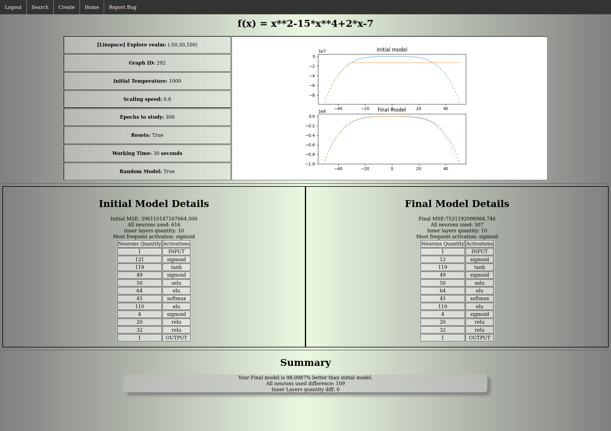

# Neural Network Designer
## Table of contents

* [Introduction](#Introduction)
* [Code Example](#code-example)
* [General info](#general-info)
* [How it works?](#how-it-works)
* [Technologies](#technologies)
* [Installation](#installation)
* [Launch](#launch)
* [License](#license)
## Introduction
Web application has been created for developers to help them optimize or directly find optimal neural network according to
 their problem. Since almost everything can be stated as mathematical evidence( function) therefore possibilities of this application are unlimited.
 So let's suppose our company have some problem. Firstly we need to figure out what we want to maximalize, minimalize and want does not touching our interest.
 When we already found out that, we can state our problem as a mathematical evidence for example 
 `f(x)=x^2+5*x-73`. 
 Now we want to find a neural network 
 prototype that will be best(good enough) to solve our problem.
 When we are designing neural network model we need to select quantity of layer, neurons ( on each layer), activation functions and much more of things like these. 
  To sum up application for stated problem can choose optimal activations, layers number, neurons quantity  etc. It can save a lot of developer time and save some time to play a chess round or spend time with family.
## Code Example
Main Loop of simulated annealing
```python
        while get_time() <= end_time and T > 0:
            T *= scale

            new_neurs, new_acts = get_random_model_scheme() if self.data[
                                                                   'resets'] and step % step_limit else random_mutation(
                acts,
                neurs)
            new_model = create_model(new_neurs, new_acts)
            self.model_prepare(new_model, self.x, self.y)
            yhat_plot, x_plot, y_plot = self.predict_y(new_model)
            nantonum(yhat_plot, y_plot)
            new_mse = mean_squared_error(y_plot, yhat_plot)

            if acceptance_probability(best_mse, mse, T) > random.uniform(0, 1):
                neurs, acts = new_neurs, new_acts
                model = new_model
                mse = new_mse

                if mse < best_mse:
                    best_mse = mse
                    best_neurs, best_acts = neurs, acts
                    best_yhat = yhat_plot
                    draw_graph(x_plot, y_plot, yhat_plot, best_mse)
                    best_model = model
            step += 1
            if step % step_limit and self.data['first_mse'] == best_mse:
                neurs, acts = get_random_model_scheme()
```

#### Example model structure in PNG format.

## General Info
- Every model that is being created or improved for given function is stored using postgres in database and assigned to it's creator ;).
- Each user before even contemplating on his own neural network could try to search through database for already found solutions to similar problems.
- Web application using django user- login and registration system.
- User can print image with generated neural network model

## How it works?
 Application is created to design neural networks what in fact is a large part of artificial intelligence.
  Program had been developed to help and improve NN results quality using computational intelligence, exactly metaheuristic algorithms.
 To improve or even create new networks I have used algorithm- simulated annealing( SA). But how does it really work ?
 So it is an algorithm based on initial solution that in given time trying to improve it, by mutating model structure.
  If we already have some model that is good, but results are not enough for us, we can input that model as initial and 
  program will improve it otherwise the initial model will be created randomly. So during runtime SA has a parameter- 
  temperature that commands how far or where our current or next research mutation// acceptance should went. The problem in metaheuristics is
   that sometimes we can stuck in local optimum. SA handling that by moving to the worse solutions in accordance with
   temperature. After given time for example 30 seconds. Program return the most optimal solution that he could find on this
   time interval. [More Wikipedia SA](https://en.wikipedia.org/wiki/Simulated_annealing)
### Details

| Initial Model | Mutations/Disturbs| Local Optimum Problem Solution |
| ------------- | ------------- | ------------- |
| randomly created model  | random layer deletion | restarts after N iterations |
| model passed by user  | random layer insertion  | moving to worse solution in accordance with temperature ( initial T0 )|
|   | change activation on random layer  |  |
|   | change neurons quantity on random layer  |  |
#### Example results


## Installation
You need to have software for every technology described in [Technologies](#technologies) installed via pip
and some more:
- libcuda1.so
- pydotplus
- make project connection with local postgres database

## Launch
To run application you just have to connect project with postgres database and run it by command
`python3 manage.py runserver`

## Technologies


- Python 3.8

- Django 3.0

- Javascript

- PosgreSQL

- HTML 5

- CSS 3


- Tensorflow (GPU)
- Keras
- Sklearn


- Numpy
- Matplotlib
- Graphviz

## License
Open- Source
